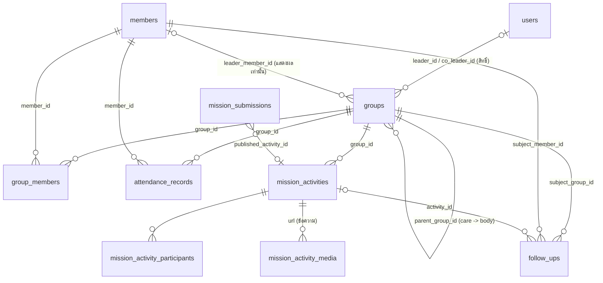
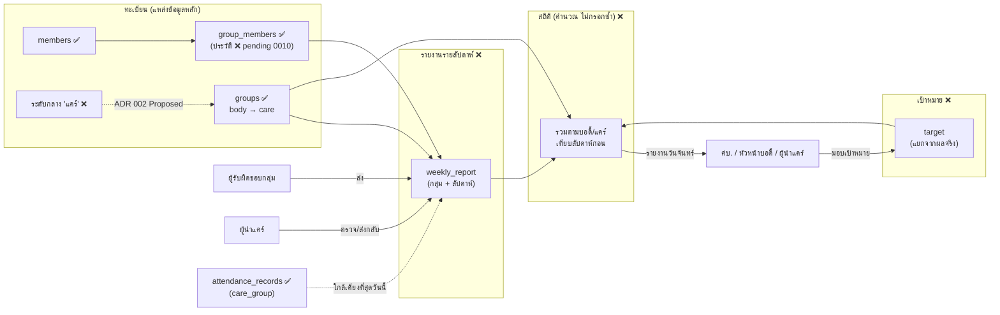

<!-- last_verified: 2026-10-10 -->
# Puntakit — Mission Operating Model: Verified Baseline

> **บทบาทของไฟล์นี้:** ฐานข้อมูลอ้างอิง ("verified baseline") ที่เทียบ *โมเดลการดำเนินงานเป้าหมาย* กับ *สิ่งที่ repository ทำได้จริง* ณ 2026-10-10 — **ไม่ใช่ข้อตัดสินใจ ไม่ใช่การรับรองความปลอดภัย/PDPA และไม่ได้บอกว่าโมเดลเป้าหมาย implemented แล้ว**
> ข้อกำหนดเป้าหมายและข้อเสนออยู่ที่ [`PRD.md`](../PRD.md) §7A, [ADR 002](./adr/adr-002.md) (ศัพท์/ระดับองค์กร), [ADR 003](./adr/adr-003.md) (สิทธิ์), [ADR 004](./adr/adr-004.md) (รายงาน/สถิติ) และแผนข้อมูลที่ [`PUNTAKIT_MISSION_DOMAIN_PLAN.md`](./PUNTAKIT_MISSION_DOMAIN_PLAN.md) — **ไฟล์นี้ไม่ทำสำเนาเนื้อหาเหล่านั้น** (ที่นี่เก็บเฉพาะ: การเทียบกับโค้ดจริง, ช่องว่าง, ผลตรวจสิทธิ์, ทะเบียนข้อตัดสินใจรวม และลำดับงาน)

> ⚠️ **ขอบเขตของหลักฐาน (เพิ่ม 2026-10-10 หลังตรวจ release):** ผลตรวจทั้งหมดในเอกสารนี้เป็นของสาขา **`master`** (`3afed5b`) แต่ **Production deploy จาก `main`** (`4dd66ab`; ยืนยันจาก Vercel) และสองสาขา **ไม่มีประวัติร่วมกัน** (tracker D58) สิ่งที่พบบน `master` จึง **ไม่ได้แปลว่าเกิดบน production** — ตัวอย่างที่ตรวจแล้ว: F1/D54 ไม่เกิดบน `main` (`member` ได้ 403; `viewer` ได้เบอร์ mask/รายชื่อว่าง) และ `member` เรียก `GET /api/members` ได้ 403 บน `main` (ต่างจาก F9 บน `master`) ส่วน F2–F8 และตารางสิทธิ์ใน §5.2 **ยังไม่ได้ตรวจกับโค้ดของ `main`** — ต้องตรวจซ้ำก่อนใช้เป็นฐานของงานบน production

**ป้ายสถานะที่ใช้:** `VERIFIED` = ยืนยันจากโค้ด/การรันในรอบนี้ (ระบุระดับหลักฐาน) · `REQUIREMENT` = ระบุไว้ในบรีฟผลิตภัณฑ์ · `ASSUMPTION` = สมมติฐานที่ยังไม่ยืนยัน · `OPEN DECISION` = ต้องให้เจ้าของผลิตภัณฑ์ตัดสิน · `BLOCKER` = ขวางงานเฉพาะอย่าง

## 0. หลักฐานและข้อจำกัดของการตรวจ

| รหัส | สิ่งที่ทำ | ระดับ |
|---|---|---|
| E1 | อ่านโค้ด: `shared/schema.ts`, `shared/roles.ts`, `shared/orgView.ts`, `server/lib/groupAccess.ts`, `server/lib/orgDataset.ts`, `server/middleware/auth.ts`, route ทุกโมดูลที่เกี่ยวข้อง (`groups`, `members`, `reports`, `dashboard`, `org`, `care`, `activities`, `submissions`, `followUps`, `attendance`), migrations 0000–0010 + `pending/`, หน้า `client/src/pages/*` | อ่านโค้ด |
| E2 | **รันจริง** probe ชั่วคราว: Express app จริง + PGlite ใน `os.tmpdir()` + ข้อมูลสังเคราะห์ + 8 บัญชี (admin, staff, ministry_leader, group_leader ×3, viewer, member) — เรียก endpoint จริงแล้วบันทึกผล ไฟล์ probe **ถูกลบแล้ว** (ไม่ commit; `git status` ก่อน/หลังเหมือนกัน) | executed |
| E3 | `grep` migrations/`pending`/`shared` หา RLS/`CREATE POLICY` | grep |
| ✗ | **ไม่ได้ตรวจ:** production, ไฟล์ Excel ต้นฉบับ/รายงานตัวอย่างของเจ้าของ (ไม่อยู่ในสภาพแวดล้อม), Clerk จริง, ข้อมูลจริงใน DB | — |

ผล E2 ใช้ป้าย "รันจริง"; ผลจาก E1 ล้วน ๆ ใช้ป้าย "โค้ด" — ต่างกันตรงที่ "โค้ด" ยังไม่ได้พิสูจน์พฤติกรรมตอนรัน

## 1. ศัพท์: บรีฟ ↔ ADR 002 ↔ โค้ด

ศัพท์ระดับองค์กรกำหนดที่ ADR 002 ที่เดียว ตารางนี้เป็นเพียงตัวแปลงสำหรับบรีฟรอบนี้

| ตำแหน่งในบรีฟ | ADR 002 | โค้ดวันนี้ (VERIFIED, โค้ด) |
|---|---|---|
| Pastor / Team Leader | ศบ. | **ไม่ใช่แถวใน `groups`** — ค่าคงที่ `HEAD_ROLE` (`shared/orgView.ts`) ชี้สมาชิกที่มี `members.role` ตรงค่านั้น; ไม่มีบทบาท `team_lead` ใน `USER_ROLES` |
| Body / Body Leader | บอดี้ | `groups.org_level='body'`; ผู้นำที่แสดง = `groups.leader_member_id` (สมาชิก) — **ไม่ใช่สิทธิ์** (`groupAccess.ts` ระบุชัด) |
| Care group / Care Leader (ระดับกลาง 20 แห่ง) | แคร์ = ระดับกลางใหม่ (**Proposed**, รอ Q24) | **ไม่มี** — `GROUP_ORG_LEVELS = ["body","care"]` |
| House-mission group (52 แห่ง) / ผู้รับผิดชอบกลุ่ม | พันธกิจบ้าน = `care` (UI "พันธกิจ") | `groups.org_level='care'`; ผู้นำเชิงสิทธิ์ = `leader_id`/`co_leader_id` (user) หรือสมาชิกกลุ่มบทบาท `leader`/`assistant_leader` ที่ผูกกับ user |
| ผู้ประสานงานท้องถิ่น | (ADR 004 W6 ยังไม่ตัดสิน) | **ไม่มีฟิลด์** — มีเฉพาะข้อความ "ผู้ประสานงาน (ต้นฉบับ)" ใน `groups.description` ที่ org-data ใส่ |
| สมาชิกกลุ่ม | สมาชิก | `members` + `group_members` |

ข้อควรระวัง (ADR 002): "ผู้นำแคร์" (เดิม = ผู้นำของ `care`) กับ "หัวหน้าแคร์" (ผู้นำระดับกลางใหม่) ห้ามใช้ปะปน

## 2. ข้อกำหนดเป้าหมาย (REQUIREMENT — ย่อ ไม่ใช่การรับรอง)

- ห้าม seed หรือฝังตัวเลข 6 / 20 / 52 / 49 ในแอป — เป็นบริบท ไม่ใช่ข้อเท็จจริงที่ตรวจแล้ว (`NOT VERIFIED`)
- สามระบบย่อยที่เชื่อมกัน: **ทะเบียนกลุ่ม** (ข้อมูลประจำ ลงทะเบียนครั้งเดียว) → **รายงานรายสัปดาห์** (เหตุการณ์/ผลของกลุ่ม+สัปดาห์ ห้ามทับทะเบียน) → **เป้าหมายและสถิติ** (รวมจากทะเบียน+รายงาน เป้าหมายแยกจากผลจริง ไม่กรอกซ้ำหลายระดับ) — รายละเอียดที่ PRD §7A / ADR 004
- กระบวนการ 6 ขั้น (ผู้รับผิดชอบกลุ่มส่งจากมือถือ → ผู้นำแคร์ตรวจ/ส่งกลับ → หัวหน้าบอดี้ทบทวนและสรุประดับบอดี้ → ศบ. ทบทวนรวมวันจันทร์ → มอบเป้าหมายลงลำดับชั้น → สัปดาห์ถัดไปบันทึกผลเทียบเป้า)
- แต่ละระดับ **ไม่เห็น/แก้เท่ากัน**; ข้อมูลส่วนบุคคลเฉพาะบทบาทที่ได้รับอนุญาต; ไม่เพิ่มขั้นอนุมัติโดยไม่มีเหตุผล

## 3. สถาปัตยกรรมปัจจุบัน (VERIFIED — โค้ด)

### 3.1 เส้นทางและหน้าที่เกี่ยวข้อง

| หัวข้อ | หน้าแอดมิน | API (`server/routes/`) | ตาราง |
|---|---|---|---|
| ทะเบียนกลุ่ม | `/groups`, `/org`, `/map`, `/church` | `groups`, `org`, `orgData` (admin), `care` (รายชื่อกลุ่มให้เช็คชื่อ) | `groups`, `group_members` |
| สมาชิก | `/members`, `/import*` | `members`, `import` | `members`, `import_*` (L1/L2) |
| เช็คชื่อ/ติดตามประจำสัปดาห์ (ใกล้เคียง "รายงาน" ที่สุด) | `/care`, `/attendance`, `/follow-up` | `attendance`, `care`, `followUps` | `attendance_records` (`service_type='care_group'`), `follow_ups` |
| กิจกรรมพันธกิจ/Feed | `/feed`, `/inbox` | `activities`, `submissions` | `mission_activities` (+`_participants`, `_media`), `mission_submissions` |
| สถิติ/รายงาน | `/`, `/reports` | `dashboard`, `reports` | อ่านจากตารางข้างบน (นับ ไม่เก็บ) |
| สมาชิก (PWA) | `/app/*` | `me` (`portal`) | `users`, `members`, `event_registrations`, `prayer_requests` |

### 3.2 ความสัมพันธ์ของข้อมูล

**ไม่มีในโค้ด (VERIFIED):** ตารางรายงานรายสัปดาห์ · ตารางเป้าหมาย · ระดับกลาง "แคร์" · ประวัติเข้า/ออกกลุ่ม (`group_members` unique ทั้งคู่; dry-run อยู่ที่ `server/db/pending/0010_group_members_history.sql` **ยังไม่ apply**) · ฟิลด์ภูมิศาสตร์แยกชั้น · นโยบายระดับฐานข้อมูล (RLS/`CREATE POLICY` **ไม่พบเลย**: การบังคับสิทธิ์อยู่ที่ชั้น Express เท่านั้น)

### 3.3 ทะเบียนกลุ่มเทียบกับข้อกำหนด

| ข้อกำหนด | สถานะ | หลักฐาน |
|---|---|---|
| ชื่อ/รหัสกลุ่ม | ✅ มี | `groups.id`, `groups.name` |
| สังกัดบอดี้ | ✅ มี | `groups.parent_group_id` + `assertOrgHierarchy` (`routes/groups.ts`) |
| สังกัดแคร์ (ระดับกลาง) | ⛔ ไม่มี | ADR 002 Q23 Proposed; ไม่มีแหล่งข้อมูล care→แคร์ (O6) |
| ผู้รับผิดชอบกลุ่ม | 🟡 บางส่วน | `leader_id`/`co_leader_id` ต้องเป็น **user**; ผู้นำที่ไม่มีบัญชี (ADR 003 S3) ทำหน้าที่ในระบบไม่ได้ |
| ผู้ประสานงานท้องถิ่น | ⛔ ไม่มีฟิลด์ | ข้อความใน `description` (`orgDataset.ts:~160`, `parseCareGroupDescription`) |
| วัน/เวลา/สถานที่ประจำ | ✅ มี (ข้อความอิสระ) | `meeting_day`, `meeting_time`, `meeting_location` |
| หมู่บ้าน/ตำบล/อำเภอ/จังหวัด | ⛔ ไม่มีคอลัมน์ | org-data ต่อเป็นข้อความเดียวใน `meeting_location`; `area` เก็บแค่อำเภอ (`orgDataset.ts:150-171`) |
| พิกัด | 🟡 มีคอลัมน์ | `latitude`/`longitude` (**text**); PRD §10: ข้อมูลนำเข้าจริง 0 พิกัด |
| รูปกลุ่ม | 🟡 มีคอลัมน์ URL | `avatar_url`/`cover_url`; **ไม่พบ endpoint อัปโหลดรูป** (Blob ใช้กับ Excel เท่านั้น — `server/lib/importBlob.ts`) |
| รายชื่อสมาชิก + จำนวนที่คำนวณ | ✅ มี | `group_members`; `memberCount` นับจาก SQL (`routes/groups.ts`, `routes/org.ts`) |
| **ไม่ซ้ำสองที่** (จำนวนที่คำนวณ vs ที่ระบุ) | ⚠️ เสี่ยง | org-data เก็บ "จำนวนสมาชิกที่ระบุ: N" เป็นข้อความใน `description` คู่กับจำนวนที่นับได้ — ต้องจัดเป็นหลักฐานนำเข้าเท่านั้น (OPEN N4) |
| สถานะกลุ่ม | ✅ | `groups.status` = `active`/`paused`/`closed` |
| ผู้รับผิดชอบการติดตาม | 🟡 | `follow_ups.owner_id`, `subject_group_id` (ไม่ผูกกับสายบังคับบัญชา) |
| บันทึกเดียวใช้ซ้ำ (แผนที่/รายงาน/จัดการ) | 🟡 | `/map` ใช้ `GET /api/groups` (`Map.tsx:248`) ✅; รายงาน/สถิติจากทะเบียนยังไม่มี |
| ข้อมูลสมาชิกที่ workflow ต้องใช้ | 🟡 | ข้อมูลอ่อนไหวจาก Excel (อายุ อาชีพ ที่ทำงาน ปีรับเชื่อ เป้าหมาย) ถูกอัดใน `members.notes` เป็นข้อความอิสระ (`orgDataset.ts`) |

## 4. กระบวนการและการไหลของข้อมูล

### 4.1 กระบวนการเป้าหมาย พร้อมสถานะของแต่ละขั้น (`REQUIREMENT` ↔ `VERIFIED`)

| ขั้น | ผู้รับผิดชอบ (บรีฟ) | ระบบรองรับวันนี้ | ช่องว่าง |
|---|---|---|---|
| 1 บันทึก/ส่งรายงานรายสัปดาห์จากมือถือ | ผู้รับผิดชอบกลุ่ม | ⛔ **ไม่มีรายงานรายสัปดาห์** · ใกล้เคียง: เช็คชื่อ `care_group` ผ่าน `/care` + สร้าง `mission_activities` | ไม่มี "จัดจริงหรือไม่", บทเรียน/พระคัมภีร์, สมาชิกใหม่, ผลลัพธ์/ปัญหา, แผนสัปดาห์หน้า; ผู้นำต้องมีบัญชี; ผู้นำใช้ **admin shell** (ไม่ใช่ PWA) |
| 2 ตรวจความครบ/ตามรายงานที่ขาด/ส่งกลับ | ผู้นำแคร์ | ⛔ ไม่มีตัวตนระดับกลางและไม่มีสถานะ "ส่งกลับ" ของรายงาน | ไม่มีรายการ "ยังไม่ส่ง" (ต้องคำนวณจากการไม่มีแถว — ADR 004) |
| 3 ทบทวนผลทั้งบอดี้/สรุประดับบอดี้ | หัวหน้าบอดี้ | ⛔ ไม่มีสิทธิ์/มุมมองตามบอดี้ (`ministry_leader` เห็นทั้งหมด) | ไม่ชัดว่า "สรุปบอดี้" เป็นมุมมองที่คำนวณหรือเอกสารที่เก็บ (OPEN N9) |
| 4 ทบทวนรวมวันจันทร์ | ศบ./หัวหน้าทีม | ⛔ ไม่มีมุมมองรวม · `/org` + `/` (PRIVILEGED) มีจำนวนบอดี้/พันธกิจ/สมาชิกเท่านั้น | ไม่มีสถิติรายงาน/เทียบสัปดาห์ก่อน |
| 5 มอบเป้าหมายลงลำดับชั้น | ศบ. → บอดี้ → แคร์ → กลุ่ม | ⛔ ไม่มีโมเดลเป้าหมาย (เฉพาะสตริง Q1–Q4 ของสมาชิกใน `notes` จากการนำเข้า) | ADR 004 W5 ยังไม่ออกแบบ |
| 6 บันทึกผลเทียบเป้า | ผู้รับผิดชอบกลุ่ม | ⛔ | พึ่งขั้น 1 และ 5 |

### 4.2 แผนภาพการไหลของข้อมูล (เป้าหมาย; ❌ = ยังไม่มี, ✅ = มีแล้ว)

### 4.3 โมเดลสถานะรายงาน (`ยังไม่ส่ง → ส่งแล้ว → ต้องแก้ไข / รับรองแล้ว`)

`VERIFIED:` ไม่มีรายงานรายสัปดาห์ในโค้ด จึงไม่มีสถานะนี้ที่ใดเลย สถานะที่มีอยู่เป็น **คนละเรื่อง**: `mission_activities` = `draft → pending_review → published → archived` (`routes/activities.ts` `STATUS_TRANSITIONS`); `mission_submissions` = `new → reviewing → needs_info → approved/rejected`; `follow_ups` = `open/in_progress/completed/cancelled`

การจับคู่กับข้อเสนอ ADR 004: "ยังไม่ส่ง" = หมวดที่ **คำนวณ** (ไม่มีฉบับปัจจุบันที่ไม่ใช่ draft) ไม่ใช่สถานะที่เก็บ · "ส่งแล้ว" = `submitted` · "ต้องแก้ไข" = `needs_revision` · "รับรองแล้ว" = `acknowledged` ADR 004 เพิ่ม `draft` และ `superseded` เพื่อควบคุมเวอร์ชัน (ตัดสิน W4) — **ไม่ใช่ขั้นอนุมัติเพิ่ม** แต่ควรให้เจ้าของยืนยันว่ายอมรับ (OPEN N10)

ประวัติผู้ส่ง/ผู้ตรวจ+เวลา: โครงสร้างที่มีแล้ว = `audit_logs` (`logAudit` ถูกเรียกในการเปลี่ยนสถานะกิจกรรมและการแก้ไขกลุ่ม/สมาชิกกลุ่ม) และ `mission_submissions.reviewed_by_id/reviewed_at`; ของรายงานรายสัปดาห์ยังไม่มี

## 5. บทบาทและสิทธิ์

### 5.1 สายบังคับบัญชา ↔ บทบาทในระบบ

| ตำแหน่ง | แทนด้วยอะไรวันนี้ | ช่องว่าง |
|---|---|---|
| ศบ./หัวหน้าทีม | `admin`/`super_admin` หรือ `ministry_leader` (ไม่มี `team_lead`) | admin มีสิทธิ์ลบ/นำเข้า เกินหน้าที่ (ADR 003) |
| หัวหน้าบอดี้ | ไม่มี — `ministry_leader` (เห็น/จัดการ **ทุกกลุ่ม** ไม่ผูกบอดี้) | ไม่มี scope ตามบอดี้ |
| ผู้นำแคร์ (ระดับกลาง) | ไม่มี | ระดับไม่มีในโค้ด |
| ผู้รับผิดชอบกลุ่ม | `group_leader` ที่ระบุทาง `leader_id`/`co_leader_id`/สมาชิกบทบาทผู้นำ | ใช้ได้เมื่อมีบัญชี; `leader_member_id` ไม่ให้สิทธิ์ |
| สมาชิก | `member` (PWA `/app/*`) | — |

### 5.2 สิทธิ์ที่ **บังคับจริง** ณ วันนี้ (VERIFIED)

ป้าย: **[รัน]** = ผลจาก probe E2 · **[โค้ด]** = อ่านโค้ด · ตัวย่อบทบาท: A=admin/super_admin, S=staff, ML=ministry_leader, GL=group_leader, V=viewer, M=member

| การกระทำ/ข้อมูล | A | S | ML | GL | V | M | หลักฐาน |
|---|---|---|---|---|---|---|---|
| เปิด admin shell | ✅ | ✅ | ✅ | ✅ | ✅ | ❌ (→ PWA) | `ADMIN_SHELL_ROLES` (ฝั่ง client; ฝั่ง server แต่ละ route คุมเอง) |
| อ่านรายการ/รายละเอียดกลุ่ม | ✅ | ✅ | ✅ | ✅ | ✅ | ✅ | `GET /groups` เพียง `requireAuth` **[รัน]**; สถานที่/พิกัดของกลุ่ม private/confidential ถูกปิดบังสำหรับ V, M และ GL ที่ไม่ใช่ผู้นำกลุ่มนั้น **[รัน]** (ยกเว้นสำหรับ `GROUP_MANAGE_ANY` และผู้นำกลุ่ม ตาม **[โค้ด]**) |
| **รายชื่อสมาชิกของกลุ่ม + เบอร์โทร (กลุ่มใดก็ได้)** | ✅ | ✅ | ✅ | ✅ | ✅ | ✅ | `GET /groups/:id/members` และ `GET /groups/:id` ส่ง `memberPhone` **ไม่ปิดบัง** ให้ทุกบทบาท **[รัน — ก่อนแก้]** → **F1** — **แก้แล้ว 2026-10-10 (D54/R7)**: ตอนนี้ A, S และ `assignedLeader` ของสมาชิกคนนั้นเห็นเบอร์จริง ส่วนบทบาทอื่นเห็นแบบ mask เหมือน `/members` (ตรวจด้วยเทสต์ 40 ข้อในเครื่อง; **ยังไม่ deploy**) |
| อ่านรายชื่อสมาชิก (`/members`) | ✅ | ✅ | ✅ | ✅ | ✅ | ✅ | เพียง `requireAuth` **[รัน]**; เบอร์/อีเมล/ที่อยู่/บันทึก **เห็นจริงเฉพาะ** A, S และผู้ที่เป็น `assignedLeader`; บทบาทอื่น (รวม ML) ถูกปิดบัง **[รัน]** |
| สร้างสมาชิก | ✅ | ✅ | ❌ | ❌ | ❌ | ❌ | `MEMBER_CREATE_ROLES` |
| แก้สมาชิก / ส่งออก CSV สมาชิก | ✅ | ✅ | ✅ | ✅ | ❌ | ❌ | `MEMBER_UPDATE_ROLES` — **ไม่จำกัดเฉพาะสมาชิกในกลุ่มที่ตนนำ** **[โค้ด]** → **F3** (CSV ถูก mask ตามบทบาท) |
| ลบ/กู้คืนสมาชิก · สร้าง/ลบกลุ่ม · events/ประกาศ/ฝ่ายงาน/ข้อมูลคริสตจักร · นำเข้า · org-data apply/rollback | ✅ | ❌ | ❌ | ❌ | ❌ | ❌ | `ADMIN_ROLES`/`requireAdmin` |
| แก้กลุ่ม + จัดการสมาชิกกลุ่ม | ✅ | ❌ | ✅ (ทุกกลุ่ม) | เฉพาะกลุ่มที่นำ | ❌ | ❌ | `verifyGroupManagementAccess`; ผู้ไม่ใช่ผู้นำ → 403 ทั้ง PUT/POST/DELETE สมาชิก **[รัน]** |
| **ผู้นำเปลี่ยนสังกัดบอดี้/ผู้นำ/ระดับของกลุ่มตนเอง** | — | — | — | ✅ | — | — | `PUT /groups/:id` ตอบ 200 และเปลี่ยน `parentGroupId`, `leaderId`, `orgLevel` ได้ **[รัน]** → **F2** (มี `logAudit`) |
| อ่านเช็คชื่อ | ✅ | ✅ | ✅ | เฉพาะกลุ่มที่นำ | ✅ (อ่าน) | ❌ 403 | `attendance.ts` + `attendanceAccess/Scope.test.ts` (เบอร์ถูก mask ตามบทบาท) |
| บันทึกเช็คชื่อ | ✅ | ✅ | ✅ | เฉพาะกลุ่มที่นำ และสมาชิกต้อง active ในกลุ่ม | ❌ | ❌ | `CREATE_ROLES` + `assertGroupWriteAccess`/`assertMembersInLedGroup` |
| ผังองค์กร `/org/overview` · `/reports/*` + CSV · `/dashboard/operations` | ✅ | ✅ | ✅ | ❌ 403 | ❌ | ❌ | `PRIVILEGED_ROLES` — **[รัน]** เฉพาะ GL (403) และ S (200); บทบาทที่เหลือตาม **[โค้ด]** |
| รายชื่อบอดี้/พันธกิจให้เช็คชื่อ `/care/groups` | ✅ | ✅ | ✅ | ✅ | ❌ | ❌ | `CREATE_ROLES` — คืน **ทั้งผังองค์กร** (ชื่อกลุ่ม ผู้นำ ผู้ประสานงานดิบ จำนวน) แม้เป็น GL **[โค้ด]** → **F5** |
| รายละเอียดสมาชิกของพันธกิจ `/org/care-groups/:id/members` | ✅ | ✅ | ✅ | ❌ | ❌ | ❌ | `PRIVILEGED_ROLES`; คืนฟิลด์อ่อนไหวที่แยกจาก `notes` (อายุ อาชีพ ที่ทำงาน ปีรับเชื่อ เป้าหมาย ผู้สร้าง) ให้ ML ด้วย ทั้งที่ `/members` ปิด `notes` ของ ML **[โค้ด]** → **F4** |
| `dashboard/summary` (ตัวเลขรวม) | ✅ | ✅ | ✅ | ✅ | ✅ | ✅ | `requireAuth` **[รัน]** (V, M ได้ 200) |
| กิจกรรมพันธกิจ: อ่าน | ✅ ทั้งหมด | ✅ ทั้งหมด | ✅ ทั้งหมด | เผยแพร่แล้ว + ของตน + กลุ่มที่นำ | เผยแพร่แล้ว + ของตน | เผยแพร่แล้ว + ของตน | `canRead` |
| กิจกรรมพันธกิจ: สร้าง / เผยแพร่ | สร้าง+เผยแพร่ | สร้าง+เผยแพร่ | สร้าง+เผยแพร่ | สร้าง; **เผยแพร่กิจกรรมกลุ่มที่ตนนำได้เอง** | ❌ | ❌ | `CREATE_ROLES`, `canPublish` **[โค้ด]** → **F7** |
| รายงานรายสัปดาห์ / เป้าหมาย / สถิติรวมตามลำดับชั้น | — | — | — | — | — | — | **ไม่มีในระบบ** |

### 5.3 ความขัดแย้งกับลำดับชั้นเป้าหมาย และผลที่ตามมา

| # | ข้อค้นพบ | ระดับหลักฐาน | ผลที่ตามมา | ความเร่งด่วนที่เสนอ |
|---|---|---|---|---|
| **F1 — แก้แล้วในโค้ด 2026-10-10 (D54/R7; ยังไม่ deploy)** | **ข้อค้นพบเดิม:** `GET /api/groups/:id/members` (`routes/groups.ts:551`) และ `GET /api/groups/:id` (`:245`) ส่ง `memberPhone` และรายชื่อ **ไม่ผ่าน `maskSensitiveData`** ให้ทุกบัญชีที่ล็อกอิน รวม `member`/`viewer` กับกลุ่มใดก็ได้ (รวม private) | **รันจริง** | เบอร์โทรสมาชิกรั่วข้ามบทบาท — ขัดเป้า G1 ของ PRD §4 ("ข้อมูลสมาชิกไม่รั่วข้ามบทบาท") และทำให้การปิดบังที่ `/members`, `/attendance` ไม่มีผล; **ไม่พบ test ที่ตรวจเบอร์สมาชิกของ endpoint นี้** (`groups.test.ts` ทดสอบ 401 และจำลองฟังก์ชันปิดบังสถานที่เท่านั้น) | **สูง — ความเป็นส่วนตัว** |
| **F2** | ผู้นำของกลุ่มแก้ `parentGroupId`/`leaderId`/`orgLevel` ของกลุ่มตนได้ (`PUT /groups/:id`) | **รันจริง** | ผู้นำย้ายกลุ่มไปบอดี้อื่น ส่งต่อความเป็นผู้นำ หรือเลื่อนเป็นบอดี้ได้เอง — ขัดแนวคิด "รับเป้าหมายจากหัวหน้า" และทำให้สายบังคับบัญชาแก้ได้จากล่างขึ้นบน (มี audit log) | สูง — สิทธิ์ |
| F3 | `PUT /members/:id` และ `GET /members/export/csv` ใช้เพียง `MEMBER_UPDATE_ROLES` — GL/ML แก้สมาชิกคนใดก็ได้ ไม่จำกัดกลุ่มตน | โค้ด | ผู้นำกลุ่มแก้ข้อมูลสมาชิกนอกกลุ่ม (ข้อความตอบกลับตอนเบอร์ซ้ำยังเปิดเผยชื่อสมาชิกอื่น) | กลาง |
| F4 | `/org/care-groups/:id/members` คืนฟิลด์อ่อนไหวที่แยกจาก `notes` ให้ `ministry_leader` ขณะที่ `/members` ปิดบัง `notes` ของบทบาทนี้ | โค้ด | นโยบายข้อมูลอ่อนไหวไม่สอดคล้องกัน — ADR 003 ต้องการให้ข้อมูลอ่อนไหวเห็นได้ตั้งแต่หัวหน้าแคร์ขึ้นไป *เฉพาะผู้ยินยอม* แต่ endpoint นี้ไม่ตรวจ `consentGiven` | กลาง |
| F5 | `/care/groups` คืนผังองค์กรทั้งหมดให้ GL | โค้ด (คอมเมนต์ในโค้ดระบุว่าตั้งใจ) | ผู้นำเห็นโครงสร้าง/ชื่อผู้นำ/ผู้ประสานงานของกลุ่มอื่น (ไม่มีเบอร์) | ต่ำ–กลาง (ต้องตัดสิน) |
| F6 | ไม่มีบทบาท/scope ตามบอดี้หรือแคร์; `ML` เห็นและจัดการทุกกลุ่ม; `leader_member_id` ไม่ให้สิทธิ์ | โค้ด | สิทธิ์ตามสายบังคับบัญชาในบรีฟทำไม่ได้โดยไม่มีงานด้านสิทธิ์ (ADR 003) | — (ช่องว่างเชิงฟีเจอร์) |
| F7 | ผู้นำเผยแพร่กิจกรรมของกลุ่มตนเอง (ไม่มีการตรวจโดยผู้บังคับบัญชา) | โค้ด | ลูกโซ่ "ตรวจ/รับรอง" ที่บรีฟต้องการยังไม่มี | — |
| F8 | ไม่มี RLS/นโยบายฐานข้อมูล | grep | การปิดบัง/สิทธิ์ทั้งหมดอยู่ที่ Express; endpoint ที่ลืม mask (F1) จึงรั่วทันที | บันทึกเป็นข้อเท็จจริง |
| F9 | บัญชี `member` (PWA) และ `viewer` เรียก `/api/members` และ `/api/groups` อ่านรายชื่อสมาชิก/กลุ่มทั้งหมดได้ (ติดต่อถูก mask) | **รันจริง** | ทะเบียนสมาชิกทั้งคริสตจักรเปิดให้ทุกบัญชีอ่านชื่อ+สถานะ+พันธกิจ | ต้องตัดสิน (OPEN N2) |

**หมายเหตุ:** F1–F9 เป็นผลตรวจ ณ 2026-10-10 — **F1 แก้แล้วในโค้ดวันเดียวกัน (D54/R7)** ส่วน **F2–F9 ยังไม่แก้** (D55–D57 รออนุมัติแยก) F1/F2/F3/F4 ถูกบันทึกเป็นหนี้ที่ [`tech-debt-tracker.md`](./exec-plans/tech-debt-tracker.md) D54–D57 ตัวช่องว่างเชิงฟีเจอร์ (F6/F7) อยู่ในแผนงาน ADR 003

### 5.4 เมทริกซ์สิทธิ์เป้าหมาย

ใช้ตารางใน [ADR 003](./adr/adr-003.md) §"เสนอ" **(`proposed` — ยังไม่ได้รับการตรวจรับ ไม่มีการเปลี่ยนสิทธิ์ใด ๆ)** ไม่ทำสำเนาที่นี่ ข้อสังเกตจากบรีฟรอบนี้ที่ ADR 003 ยังไม่ครอบคลุมหรือต้องย้ำ:
- ผู้นำกลุ่มควรแก้ **ข้อมูลประจำของกลุ่ม** (เวลา/สถานที่/รายชื่อ) แต่ไม่ควรแก้ **ตำแหน่งในสายบังคับบัญชา** (F2) — ต้องตัดสินว่าฟิลด์ใดผู้นำแก้เองได้ (OPEN N7)
- "สรุประดับบอดี้" ของหัวหน้าบอดี้ (ขั้น 3) ไม่มีสิทธิ์/ข้อมูลรองรับใน ADR 003/004 (OPEN N9)
- การปิดบังเบอร์ต้องเป็นนโยบายเดียวทุก endpoint ที่คืนสมาชิก (F1/F4) ก่อนมีรายงานที่อ้างอิงสมาชิกเพิ่ม

## 6. ผลวิเคราะห์ช่องว่าง (Gap analysis)

| ความสามารถ | สถานะ | หลักฐาน/ที่อยู่ |
|---|---|---|
| โครงสร้าง body → care (2 ระดับ) พร้อมตรวจกฎลำดับชั้น | ✅ ทำงาน | `assertOrgHierarchy`, `/org`, `groups` |
| ระดับกลาง "แคร์" | ⛔ ไม่มี / รอ Q24 | ADR 002 |
| ทะเบียนกลุ่ม (ชื่อ เวลา สถานที่ สถานะ ผู้นำ) | ✅/🟡 ทำงาน แต่ผู้ประสานงาน/ภูมิศาสตร์ไม่เป็นโครงสร้าง | §3.3 |
| รายชื่อสมาชิกกลุ่ม + จำนวนที่คำนวณ | ✅ (ประวัติเข้า/ออก ⛔ รอ migration 0010) | `group_members`, `server/db/pending/` |
| แผนที่ (กลุ่มเดียวกับทะเบียน) | ✅ (ข้อมูลพิกัดจริงยังไม่มี) | `Map.tsx` → `/api/groups` |
| เช็คชื่อรายกลุ่ม/ติดตามขาด | ✅ | `/care`, `/attendance`, `routes/care.ts` |
| กิจกรรมพันธกิจ + ตรวจก่อนเผยแพร่ | 🟡 มี แต่ไม่ใช่ "รายงานรายสัปดาห์" และไม่ตรวจโดยผู้บังคับบัญชา | `routes/activities.ts` |
| **รายงานรายสัปดาห์ (จัดจริงหรือไม่/บทเรียน/ผลลัพธ์/สมาชิกใหม่/แผนสัปดาห์หน้า)** | ⛔ ไม่มี | ADR 004 (proposed) |
| **เป้าหมายรายสัปดาห์/ไตรมาส แยกจากผลจริง** | ⛔ ไม่มี (ไม่มีทั้งตารางและแผน) | ADR 004 W5 |
| **สถิติรวมตามบอดี้/แคร์ เทียบสัปดาห์ก่อน** | ⛔ ไม่มี (มีนับพื้นฐาน: `/reports/summary`, `/dashboard/*`, `org/overview`) | `routes/reports.ts`, `routes/dashboard.ts` |
| มุมมองรวมวันจันทร์ | ⛔ ไม่มี | — |
| สิทธิ์ตามสายบังคับบัญชา | ⛔ ไม่มี — และมีช่องโหว่ความเป็นส่วนตัวเดิม (F1–F4) | §5 |
| ประวัติผู้ส่ง/ผู้ตรวจ+เวลา (ของรายงาน) | ⛔ ไม่มี (มีโครงสร้าง `audit_logs`) | `lib/audit.ts` |
| รูปกลุ่ม/รูปกิจกรรม | 🟡 เก็บ URL ได้ แต่ไม่มีการอัปโหลด | `groups.avatar_url`, `mission_activity_media.url` |
| ตรวจ production/ตัวเลข 6/20/52/49 | ❓ ตรวจไม่ได้ | Q24 / O4 |
| นโยบายระดับฐานข้อมูล | ⛔ ไม่มี | F8 |

## 7. "49 กลุ่มที่ดำเนินการ" หมายถึงอะไร

`VERIFIED:` ตัวเลข 49 **ไม่ได้อยู่ในโค้ดหรือข้อมูล** — มาจากเจ้าของเท่านั้น (PRD §3/§12, ADR 002, `MISSION_DOMAIN_PLAN` §head) และตรวจไม่ได้ ทั้งนี้เลข 49 ใน `PUNTAKIT_MISSION_SOURCE_AUDIT.md` §4 เป็น **จำนวนแถวที่ช่อง `response` ว่าง** (625 กรอก / 49 ว่าง จาก 674 แถว) **ไม่เกี่ยวกับจำนวนกลุ่ม ห้ามนำมาอ้าง**

ความหมายที่เป็นไปได้ (`ASSUMPTION` ทั้งหมด — ต้องให้เจ้าของเลือก; ผูกกับ ADR 002 O4 และตัวหาร "active" ของ ADR 004):

| ตัวเลือก | นิยาม | ในโค้ด |
|---|---|---|
| (ก) สถานะทะเบียน | `groups.status = 'active'` ณ ปัจจุบัน | มี (`reports/summary` นับตาม `groups.status`) |
| (ข) จัดกิจกรรมจริงในสัปดาห์ | รายงานรับรองแล้วและ `held = true` (ADR 004 หมวด 1) | ยังไม่มี |
| (ค) มีผู้นำที่ส่งรายงานได้ | มีบัญชี/ผู้นำตามนิยามสิทธิ์ | บางส่วน (ต้องมีบัญชี — S3) |

ผลต่อสถิติ: (ก) เปลี่ยนตามการดูแลทะเบียน, (ข) เปลี่ยนทุกสัปดาห์, ห้ามนับ "ไม่ส่งรายงาน" เป็น "ไม่ได้จัด" (PRD §7A) **BLOCKER สำหรับการออกแบบตัวหารสถิติ จนกว่าจะเลือก (N1)**

## 8. ทะเบียนข้อตัดสินใจ (Open decisions register)

**สงวนไว้ตามเดิม (ไม่เปลี่ยนสถานะในเอกสารนี้):** ADR 002–004 ทั้งหมด `proposed` · **Q21** ผู้ใช้ยังไม่รับรองภาพ `MemberHome` · **Q13** ไม่เริ่ม · **Q24** `NOT VERIFIED` (BLOCKER: ต้องหลักฐาน read-only จากผู้ดูแล production) · ข้อห้ามทั้ง 13 ข้อ · `.ai/DECISIONS.md` D14/D16/D17/D19–D23/D25 ยัง open

| รหัส | เรื่อง | สถานะ | ผลกระทบ |
|---|---|---|---|
| O1–O6 | ADR 002: ชื่อระดับกลาง, ความสัมพันธ์สมาชิก, `groupKind`, ตัวเลข, หนค./หนบ., แหล่ง care→แคร์ | open (ADR 002) | โครงสร้าง 3 ระดับ |
| S2–S8 | ADR 003: ใครสร้างกลุ่ม, เชิญผู้นำเข้า Clerk/ถอนสิทธิ์, ส่งออกรายคน, ทบทวนข้อมูลส่วนบุคคล, รูปถ่าย, อนุมัติตนเอง, มอบ `team_lead` | open (ADR 003) | สิทธิ์ทั้งหมด |
| W5–W11 | ADR 004: โมเดลเป้าหมาย, ผู้ประสานงาน, ผู้มาใหม่, หมวด `needs_revision`/`held=false`, ปิดรอบ, ทิ้งร่าง, ร่างแก้ไข | open (ADR 004; D19–D21 มีคำแนะนำ) | รายงาน/สถิติ |
| **N1** | **ความหมาย "49 กลุ่มที่ดำเนินการ"** และตัวหารของสถิติ (§7) | **OPEN — BLOCKER ของการออกแบบสถิติ** | ตัวเลขรายงานวันจันทร์ |
| **N2** | บัญชี `member` (PWA) และ `viewer` ควรอ่านทะเบียนสมาชิก/กลุ่มได้แค่ไหน (F9) | OPEN | ความเป็นส่วนตัว |
| **N3** | ภูมิศาสตร์ของกลุ่ม: คอลัมน์แยกชั้น (หมู่บ้าน/ตำบล/อำเภอ/จังหวัด) หรือข้อความ; พิกัด `text` → ตัวเลข | OPEN | ทะเบียน/แผนที่/สถิติรายพื้นที่ |
| **N4** | จำนวนสมาชิก "ที่ระบุ" ในข้อมูลนำเข้า (ข้อความใน `description`) เก็บเป็นหลักฐานนำเข้าเท่านั้นหรือไม่ — จำนวนใช้งานต้องคำนวณจาก `group_members` | OPEN | ห้ามกรอกซ้ำ |
| **N5** | จัดเก็บรูป (กลุ่ม/กิจกรรม): ผู้ให้บริการเก็บไฟล์ การขอความยินยอม ขนาด/ชนิด (ผูก S6) | OPEN | ยังไม่มีการอัปโหลด |
| **N6** | "ผู้รับผิดชอบกลุ่ม" กับ "ผู้ประสานงานท้องถิ่น": เป็นคนเดียวกันหรือไม่ และต้องเป็นผู้ใช้ (Clerk) หรือเป็นสมาชิกก็พอ (ผูก W6, S3) | OPEN | ใครส่งรายงานได้ |
| **N7** | ฟิลด์ใดของกลุ่มที่ผู้นำแก้เองได้ (ห้าม/อนุญาต: สังกัด ผู้นำ ระดับ) (F2) | OPEN | สิทธิ์ |
| **N8** | นโยบายเปิดเผยข้อมูลอ่อนไหว (บันทึก/อายุ/อาชีพ/เป้าหมาย) ที่ `notes` ตามลำดับชั้นและ `consentGiven` (F4) | OPEN (ผูก S5) | ความเป็นส่วนตัว |
| **N9** | "สรุประดับบอดี้" ของหัวหน้าบอดี้ เป็นมุมมองที่คำนวณหรือเอกสารที่เก็บ/รับรอง | OPEN | โมเดลสถานะ/สิทธิ์ |
| **N10** | ยืนยันว่า `draft`/`superseded` ใน ADR 004 (ควบคุมเวอร์ชัน) ไม่นับเป็นขั้นอนุมัติเพิ่ม | OPEN (ยืนยัน) | โมเดลสถานะ |
| **N11** | เป้าหมายต้องแยกจากผลจริงในตารางคนละส่วน — ยืนยันข้อบังคับนี้ใน ADR 004 W5 ก่อนออกแบบ | OPEN | ป้องกันสับสนเป้ากับผล |

**BLOCKERS ที่ตรวจพบ:** Q24 (ขวางการยืนยันโครงสร้าง 3 ระดับ) · N1 (ขวางตัวหารสถิติ) · ~~F1~~ (แก้แล้ว 2026-10-10) · F2–F4 (ควรแก้ก่อนขยายข้อมูลส่วนบุคคล — ไม่ใช่ blocker ของเอกสาร)

## 9. ลำดับงานที่แนะนำ (ตามการพึ่งพาและความเสี่ยง)

**ไม่ใช่การอนุมัติ** — ทุกขั้นที่แตะโค้ด/สิทธิ์/ฐานข้อมูลต้องได้รับอนุมัติแยก

| ขั้น | งาน | ประเภท | พึ่ง | หมายเหตุ |
|---|---|---|---|---|
| 0 | เจ้าของทบทวนเอกสารฐานนี้ + ตัดสิน N1, ยืนยันศัพท์ O1/O5, ได้หลักฐาน Q24 | เอกสาร | — | ไม่แตะโค้ด |
| 1 | **ปิดช่องความเป็นส่วนตัวที่มีอยู่ (~~F1~~ ปิดแล้ว 2026-10-10 ในเครื่อง; เหลือ F2/F3/F4)**: ใช้การปิดบังชุดเดียวกับ `/members` กับ endpoint ที่คืนสมาชิก; จำกัดฟิลด์ที่ผู้นำแก้; เพิ่ม **เทสต์ route จริง** (หลายบทบาท) | backend + authz + testing | อนุมัติ + ตัดสิน N2/N7/N8 | **ขั้นต่ำก่อนขยาย UI ที่แสดงข้อมูลสมาชิกเพิ่ม**; ไม่เปลี่ยนสคีมา |
| 2 | ฐานข้อมูลกลุ่ม: ผ่าน pre-check + apply `0010_group_members_history` (T5) | migration | อนุมัติ; Q24 (สำหรับข้อมูลองค์กรจริง) | รายงานต้องมีประวัติสมาชิกก่อน (PRD §11) |
| 3 | ตัดสิน N3/N4/N5/N6 แล้วค่อยปรับทะเบียน (ภูมิศาสตร์ โปรไฟล์ผู้รับผิดชอบ ที่มาของจำนวนสมาชิก) | เอกสาร → migration → backend → frontend | N3–N6 | ทำทีละส่วน |
| 4 | ระดับกลาง "แคร์" + ข้อมูล care→แคร์ | migration + backend | Q24 + O1/O6 + ข้อมูลที่ตรวจแล้ว | ห้ามสร้างแถวเพื่อให้ตัวเลขตรง |
| 5 | **สิทธิ์ตามสายบังคับบัญชา** (`getLedGroupIds` ขยายสู่กลุ่มลูก + `team_lead`) พร้อม security tests **ก่อน** เปิดฟีเจอร์ | authz + testing | ADR 003 ตรวจรับ; ขั้น 1; ขั้น 4 (ถ้าใช้ระดับกลาง) | ไม่สร้างระบบสิทธิ์ที่สอง |
| 6 | พิสูจน์ดีไซน์ดัชนีเวอร์ชัน W4 บน PGlite (เทสต์ก่อนมีตารางจริง) | testing | อนุมัติ (แผน §6 ข้อ 6) | |
| 7 | **รายงานรายสัปดาห์**: สคีมา → API → หน้าส่งบนมือถือ → หน้า "ตรวจ/ส่งกลับ" | migration → backend → frontend | ขั้น 2, 5, 6; W8/W10/W11; S3/S7 | |
| 8 | **เป้าหมาย + สถิติ** (คำนวณ ไม่กรอกซ้ำ; เป้า ≠ ผล) + มุมมองรวมวันจันทร์ | backend → frontend | ขั้น 7; W5; N1; N11 | |
| 9 | ขยาย UI ตามบทบาท (ศบ./หัวหน้าบอดี้/ผู้นำแคร์) | frontend | ขั้น 5, 7, 8 | Member PWA ยังติด Q21/Q13 |

**ขั้นต่ำก่อนขยาย UI ที่แสดงข้อมูลสมาชิก/สถิติ:** ขั้น 0 (N1) + ขั้น 1 (ปิด F2–F4 พร้อมเทสต์; F1 ปิดแล้ว) UI ที่ไม่แตะข้อมูลสมาชิก/สิทธิ์ (เช่น ปรับการแสดงผลหน้าเดิม) ไม่พึ่งขั้นเหล่านี้

**แยกตามงาน:** *เอกสาร* ขั้น 0, 3 · *backend* ขั้น 1, 3, 4, 7, 8 · *authz* ขั้น 1, 5 · *migration* ขั้น 2, 3, 4, 7 · *frontend* ขั้น 3, 7, 8, 9 · *testing* ขั้น 1, 5, 6, ทุกขั้น

## 10. การตรวจที่ทำ และสิ่งที่ยังไม่ได้ตรวจ

**ทำแล้ว:** อ่านโค้ดตาม E1 · probe รันจริง (E2) 8 บัญชี ~30 คำเรียก endpoint จริงบน PGlite ชั่วคราว (ผลที่อ้างทุกแถวป้าย [รัน] มาจากนี้) · ตรวจซ้ำผู้ไม่ใช่ผู้นำถูก 403 ทั้ง PUT/POST/DELETE (รันรอบที่สองด้วยบัญชีที่ไม่เคยเป็นผู้นำ เพราะรอบแรกลำดับการทดสอบปนผล) · grep RLS/นโยบาย

**ยังไม่ได้ตรวจ:** production และข้อมูลจริง · ไฟล์ Excel ต้นฉบับ · พฤติกรรมกับ Clerk จริง (ใช้ cookie ทดสอบ) · F3/F4/F5/F7 ยืนยันจากโค้ดเท่านั้น (ยังไม่รัน) · ผลต่อ Neon/ production driver · ไม่ได้แปลง probe เป็น test ถาวร (แนะนำให้ทำในขั้น 1 เมื่อได้รับอนุมัติ)
